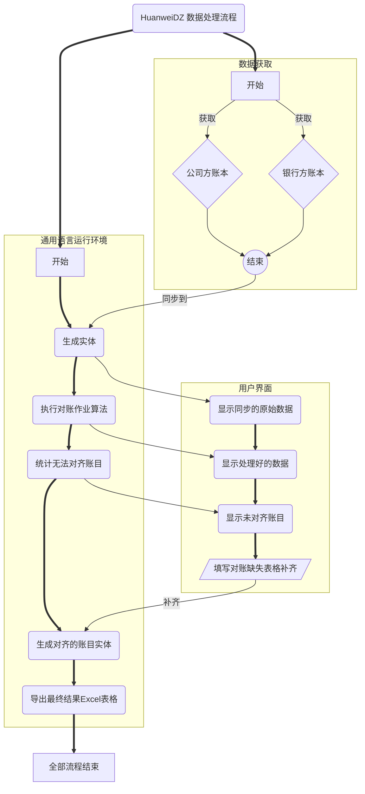
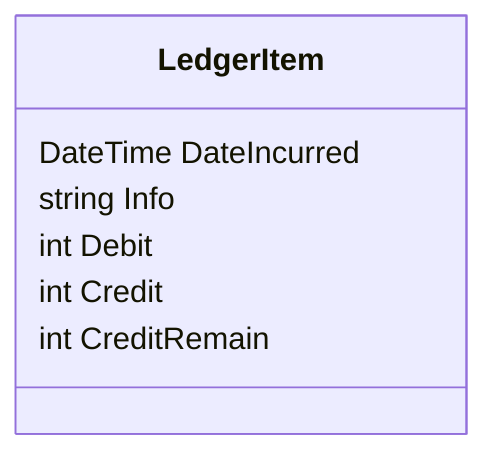

# HuanweiDZ 设计文档

本文档记录了 HuanweiDZ 工具的设计模式

# 版本 1.0.0.0 α

测试用的 Alpha 版，主要用于进行兼容性测试。

具有正式版的所有特征，外加一些用于 Debug 的语句

## 数据流图（Data Flow Diagrams）

```mermaid
graph TD
	A("HuanweiDZ 数据处理流程") ==> G["开始"]
	A("HuanweiDZ 数据处理流程") ==> H["开始"]
	subgraph "数据获取"
    G -- "获取" --> B{"公司方账本"}
	G -- "获取" --> C{"银行方账本"}
	B --> I(("结束"))
	C --> I
	end
	subgraph 通用语言运行环境
	H ==> D("生成实体")
	I -- "同步到" --> D
	D ==> E("执行对账作业算法")
	E ==> K("统计无法对齐账目")
	K ==> N("生成对齐的账目实体")
	N ==> P("导出最终结果Excel表格")
	end
	subgraph 用户界面
	D --> F("显示同步的原始数据")
	E --> J("显示处理好的数据")
	F ==> J
	K --> L("显示未对齐账目")
	J ==> L
	L ==> M[/"填写对账缺失表格补齐"/]
	M --> |"补齐"| N
	end
	P ==> O["全部流程结束"]
```

## 实体关系图（Entity Relationship Diagrams）

```mermaid
classDiagram
class LedgerItem{
    DateTime DateIncurred
    string Info
    int Debit
    int Credit
    int CreditRemain
}
```